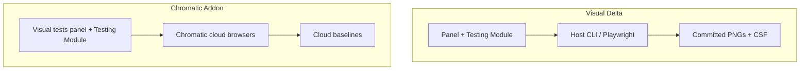

# Parity with Chromatic Visual Tests addon

Gap analysis of this package against [`@chromatic-com/storybook`](https://www.npmjs.com/package/@chromatic-com/storybook)
(Chromatic Visual Tests addon). Focus: Storybook **configuration** and
**manager views**. Cloud/CI product features are intentional non-goals.

`@chromatic-com/storybook` is not a dependency of this repo. Compare UX here
is local Playwright PNGs + CSF; Chromatic is cloud capture + OAuth project
linking.

## Models

|                | Visual Delta                         | `@chromatic-com/storybook`                     |
| -------------- | ------------------------------------ | ---------------------------------------------- |
| Capture        | Local Playwright PNGs (committed)    | Cloud browsers                                 |
| Baselines      | Git files + `parameters.visualDelta` | Cloud baselines + local-build accepts          |
| Auth / project | None                                 | OAuth + `projectId` in `chromatic.config.json` |
| Network        | Offline-capable (dev + Playwright)   | Requires Chromatic + Git                       |

## Configuration gaps

### Addon / project config

| Chromatic                                                                                            | Visual Delta                                                                                          | Status                                          |
| ---------------------------------------------------------------------------------------------------- | ----------------------------------------------------------------------------------------------------- | ----------------------------------------------- |
| `chromatic.config.json` (`projectId`, `buildScriptName`, `debug`, `zip`, `onlyChanged`/TurboSnap, …) | `options.visualDelta` in Storybook main + panel **Configuration** view (`GET /__visual-delta/config`) | Local config UI; no TurboSnap / projectId / zip |
| Addon `options.configFile`                                                                           | Options object only                                                                                   | Intentional (host wires main.ts)                |
| CI `projectToken`                                                                                    | `VISUAL_UPDATE_APPROVED=1` + host CLI                                                                 | Different model                                 |

### Story parameters

| Chromatic (`parameters.chromatic`)                | Visual Delta (`parameters.visualDelta`)                                     | Status                                                  |
| ------------------------------------------------- | --------------------------------------------------------------------------- | ------------------------------------------------------- |
| `modes`                                           | `modes` (+ optional per-mode `src` / `globals`) + panel mode selector       | Local-achievable; host suite must capture per-mode PNGs |
| `disableSnapshot` / `disable`                     | `skip-visual` tag                                                           | Equivalent                                              |
| `diffThreshold`                                   | `diffThreshold` (pixelmatch 0–1)                                            | Wired for Live Diff                                     |
| Pass % threshold                                  | `passThresholdPercent`                                                      | Existing; Live Diff default 0.1%                        |
| `diffIncludeAntiAliasing`                         | `diffIncludeAntiAliasing`                                                   | Wired for Live Diff                                     |
| `delay`                                           | `delay` (ms before capture)                                                 | Wired for Live Diff (+ Chromium capture request)        |
| `ignoreSelectors` + `data-chromatic="ignore"`     | `ignoreSelectors` + `data-visual-delta-ignore` / Chromatic-compatible attrs | Wired + highlight toolbar                               |
| `cropToViewport`                                  | `cropToViewport`                                                            | Wired for Live Diff HTML capture                        |
| `viewports` (legacy)                              | Per-image `viewport` / mode globals                                         | Prefer modes                                            |
| `forcedColors` / `prefersReducedMotion` / `media` | Not supported                                                               | Optional later                                          |
| Mid-play steps                                    | `interactions[]`                                                            | Advantage vs Chromatic                                  |
| Overlay knobs                                     | `align`, `placement`, `opacity`, …                                          | Advantage                                               |

### Modes / matrix

Chromatic stacks project→component→story modes with independent baselines and
browser × mode selectors.

Visual Delta: `parameters.visualDelta.modes` expands Default plus every enabled
mode into independent local comparisons. The Playwright suite serializes each
mode's Storybook globals, continues through the whole matrix, writes
`--{modeSlug}-chromium-darwin` PNGs and sidecars, and then aggregates the story
result. Explicit `mode.src` remains authoritative; the filename convention
fills only missing sources. Multi-browser cloud matrix remains out of scope.

## Manager / view gaps

| View / control                                      | Chromatic                | Visual Delta                                                                              | Status               |
| --------------------------------------------------- | ------------------------ | ----------------------------------------------------------------------------------------- | -------------------- |
| Visual tests panel                                  | Auth → run → neon review | Create / run / diff / overlay / review                                                    | Different onboarding |
| Testing Module                                      | Run/stop + warnings      | Visual Tests + Create Baselines                                                           | Partial              |
| Sidebar change badges                               | Yellow for changes       | Sidecar status + host tag badges                                                          | Close                |
| Accept / Unaccept (story / component / current run) | Cloud baseline accept    | Review tags; current run batches distinct eligible results and excludes missing baselines | Done                 |
| Deny                                                | CI only                  | N/A                                                                                       | Parity               |
| Browser selector                                    | Project browsers         | None                                                                                      | Cloud-only           |
| Mode selector                                       | From cloud results       | Accessible result-aware selector with pass/fail/new/error state and globals               | Done                 |
| Baseline ↔ Latest / Focus / Diff                   | Yes                      | 2-up, Swipe, Diff, Focus, Blink                                                           | Advantage            |
| Live canvas overlay                                 | No                       | Placement pad + split panes                                                               | Advantage            |
| Highlight ignored                                   | Toolbar + matched count  | Toolbar hidden at zero; distinct live count otherwise                                     | Done                 |
| Share Storybook                                     | Toolbar publish          | None                                                                                      | Cloud-only           |
| Configuration screen                                | Structured settings      | Read-only Setup, Baselines, Capture, Commands, setting diagnostics, collapsed raw details | Done                 |
| Guided tour                                         | Onboarding               | Empty-state Create CTA                                                                    | Optional later       |
| Review layout                                       | No                       | Yes                                                                                       | Advantage            |
| Interaction accordion                               | No                       | Yes                                                                                       | Advantage            |
| Diff HTML vs Chromium                               | N/A                      | Yes                                                                                       | Advantage            |

## Intentional non-goals

- OAuth, project linking, snapshot billing, cloud UI Review queue
- TurboSnap dependency-graph skip (unless a local analog is added later)
- Multi-browser cloud farm
- Auto-sync accept from local build → CI build
- Share-published Storybook from toolbar
- Cloud authentication, permissions, billing, and guided-tour flows
- New media / forced-colors / accessibility capture matrices in this slice

## Regression-hardening status

- Production and catalog stories render the same deterministic `PanelView`;
  Storybook hooks, channel traffic, persistence, and HTTP remain in the manager
  controller.
- Canonical panel stories carry `visual-delta-self-test` and `skip-visual`, so
  they exercise the real surface without recursively entering the product
  screenshot suite.
- `pnpm test:visual-delta-panel` runs 25 focused browser tests against 32
  reviewed self-test screenshots. The lane covers pass, running, configuration
  warning, missing baseline, mixed-mode failure, and capture error at
  wide-bottom and narrow-right sizes.
- The real preview overlay is gated at above, left, right, and below placements
  for both component-clipped and full-viewport baseline images. Every placement
  has a full manager-window screenshot and a preview-overlay screenshot, plus
  structural assertions for pane direction and baseline/live ordering.
- Static-manager tests cover registration, stale story cleanup, bottom/right
  docking and review-layout restoration, mode globals, ignored-region feedback,
  and write-endpoint interception. NDJSON reconnect has a focused controller
  regression test.
- A development-manager lane opens Storybook's real sidebar Testing Module,
  story context menu, and baseline-mode chooser. It verifies the provider is
  registered only where Storybook supports it and intercepts every Visual Delta
  write endpoint.
- The host and packaged visual suites share capture readiness: wait for
  Storybook `storyFinished`, clear preparation overlays, await fonts, then
  apply only the story's explicit delay.
- `test:visual-delta-panel:update` is separately gated with
  `VISUAL_UPDATE_APPROVED=1`; product-component baselines are outside its
  snapshot directory.

## Parity backlog (implemented / remaining)

| Priority | Item                                                               | In package                                                                                    |
| -------- | ------------------------------------------------------------------ | --------------------------------------------------------------------------------------------- |
| 1        | Modes matrix (CSF + panel selector + globals)                      | **Done** — Default plus every enabled mode is captured and aggregated                         |
| 2        | Ignore regions + highlight toolbar                                 | **Done** — distinct matched-element count and stale-state reset                               |
| 3        | CSF capture knobs (`diffThreshold`, AA, `delay`, `cropToViewport`) | **Done** — Live Diff + Chromium Diff; Playwright reads DOM markers from the preview decorator |
| 4        | Accept / Unaccept batch UX                                         | **Done** — Story, Component, and Current run                                                  |
| 5        | Configuration panel                                                | **Done** — structured sections + typed diagnostics                                            |
| 6        | Sidebar “has changes” polish                                       | Existing sidecar status; further polish optional                                              |
| 7        | `forcedColors` / reduced-motion / guided tour                      | Not yet                                                                                       |
