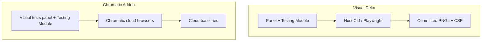

# Parity with Chromatic Visual Tests addon

Gap analysis of this package against [`@chromatic-com/storybook`](https://www.npmjs.com/package/@chromatic-com/storybook)
(Chromatic Visual Tests addon). Focus: Storybook **configuration** and
**manager views**. Cloud/CI product features are intentional non-goals.

`@chromatic-com/storybook` is not a dependency of this repo. Compare UX here
is local Playwright PNGs + CSF; Chromatic is cloud capture + OAuth project
linking.

## Models

| | Visual Delta | `@chromatic-com/storybook` |
|--|--------------|----------------------------|
| Capture | Local Playwright PNGs (committed) | Cloud browsers |
| Baselines | Git files + `parameters.visualDelta` | Cloud baselines + local-build accepts |
| Auth / project | None | OAuth + `projectId` in `chromatic.config.json` |
| Network | Offline-capable (dev + Playwright) | Requires Chromatic + Git |

## Configuration gaps

### Addon / project config

| Chromatic | Visual Delta | Status |
|-----------|--------------|--------|
| `chromatic.config.json` (`projectId`, `buildScriptName`, `debug`, `zip`, `onlyChanged`/TurboSnap, …) | `options.visualDelta` in Storybook main + panel **Configuration** view (`GET /__visual-delta/config`) | Local config UI; no TurboSnap / projectId / zip |
| Addon `options.configFile` | Options object only | Intentional (host wires main.ts) |
| CI `projectToken` | `VISUAL_UPDATE_APPROVED=1` + host CLI | Different model |

### Story parameters

| Chromatic (`parameters.chromatic`) | Visual Delta (`parameters.visualDelta`) | Status |
|-----------------------------------|----------------------------------------|--------|
| `modes` | `modes` (+ optional per-mode `src` / `globals`) + panel mode selector | Local-achievable; host suite must capture per-mode PNGs |
| `disableSnapshot` / `disable` | `skip-visual` tag | Equivalent |
| `diffThreshold` | `diffThreshold` (pixelmatch 0–1) | Wired for Live Diff |
| Pass % threshold | `passThresholdPercent` | Existing; Live Diff default 0.1% |
| `diffIncludeAntiAliasing` | `diffIncludeAntiAliasing` | Wired for Live Diff |
| `delay` | `delay` (ms before capture) | Wired for Live Diff (+ Chromium capture request) |
| `ignoreSelectors` + `data-chromatic="ignore"` | `ignoreSelectors` + `data-visual-delta-ignore` / Chromatic-compatible attrs | Wired + highlight toolbar |
| `cropToViewport` | `cropToViewport` | Wired for Live Diff HTML capture |
| `viewports` (legacy) | Per-image `viewport` / mode globals | Prefer modes |
| `forcedColors` / `prefersReducedMotion` / `media` | Not supported | Optional later |
| Mid-play steps | `interactions[]` | Advantage vs Chromatic |
| Overlay knobs | `align`, `placement`, `opacity`, … | Advantage |

### Modes / matrix

Chromatic stacks project→component→story modes with independent baselines and
browser × mode selectors.

Visual Delta: `parameters.visualDelta.modes` expands to gallery entries (and
optional Storybook globals when a mode is selected). Baseline file naming for
modes uses a `--{modeSlug}` stem convention (see `modeBaselineSlug` in
`src/shared/modes.ts`). Multi-browser cloud matrix remains out of scope.

## Manager / view gaps

| View / control | Chromatic | Visual Delta | Status |
|----------------|-----------|--------------|--------|
| Visual tests panel | Auth → run → neon review | Create / run / diff / overlay / review | Different onboarding |
| Testing Module | Run/stop + warnings | Visual Tests + Create Baselines | Partial |
| Sidebar change badges | Yellow for changes | Sidecar status + host tag badges | Close |
| Accept / Unaccept (story / component) | Cloud baseline accept | Accept / Unaccept split over review tags | Local-achievable |
| Deny | CI only | N/A | Parity |
| Browser selector | Project browsers | None | Cloud-only |
| Mode selector | From cloud results | Panel mode selector from CSF `modes` | Local-achievable |
| Baseline ↔ Latest / Focus / Diff | Yes | 2-up, Swipe, Diff, Focus, Blink | Advantage |
| Live canvas overlay | No | Placement pad + split panes | Advantage |
| Highlight ignored | Toolbar | Toolbar **Highlight ignored** | Local-achievable |
| Share Storybook | Toolbar publish | None | Cloud-only |
| Configuration screen | Read-only config JSON | Panel **Configuration** | Local-achievable |
| Guided tour | Onboarding | Empty-state Create CTA | Optional later |
| Review layout | No | Yes | Advantage |
| Interaction accordion | No | Yes | Advantage |
| Diff HTML vs Chromium | N/A | Yes | Advantage |

## Intentional non-goals

- OAuth, project linking, snapshot billing, cloud UI Review queue
- TurboSnap dependency-graph skip (unless a local analog is added later)
- Multi-browser cloud farm
- Auto-sync accept from local build → CI build
- Share-published Storybook from toolbar

## Parity backlog (implemented / remaining)

| Priority | Item | In package |
|----------|------|------------|
| 1 | Modes matrix (CSF + panel selector + globals) | **Done** — host suite still captures one PNG per story unless mode PNGs are authored |
| 2 | Ignore regions + highlight toolbar | **Done** |
| 3 | CSF capture knobs (`diffThreshold`, AA, `delay`, `cropToViewport`) | **Done** — Live Diff + Chromium Diff; Playwright reads DOM markers from the preview decorator |
| 4 | Accept / Unaccept batch UX | **Done** |
| 5 | Configuration panel | **Done** (`GET /__visual-delta/config`) |
| 6 | Sidebar “has changes” polish | Existing sidecar status; further polish optional |
| 7 | `forcedColors` / reduced-motion / guided tour | Not yet |
