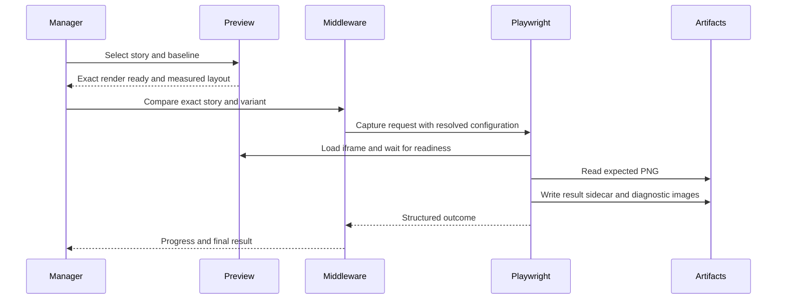

# Visual Delta architecture

This reference defines process boundaries, ownership, data flow, lifecycle, and failure isolation for Visual Delta. It separates presentation, rendering, orchestration, capture, artifacts, and repository operations.

## Component boundaries

Each component owns a bounded part of the system:

| Component               | Owns                                                                                                 | Must not own                                                              |
| ----------------------- | ---------------------------------------------------------------------------------------------------- | ------------------------------------------------------------------------- |
| Storybook manager       | Panel, Testing Module, toolbar status, action intent, progress presentation                          | Direct filesystem writes, screenshot capture, repository commands         |
| Storybook preview       | Story decorators, render readiness, capture metadata, overlay and split layout, interaction parking  | Baseline mutation, static-build decisions, repository state               |
| Dev middleware          | Request validation, exact scope, process coordination, change tracking, static-build policy, run hub | Product rendering, pixel algorithms, unapproved baseline writes           |
| CLI and host writers    | Approved baseline capture, wiring changes, skip and include source edits, scaffolding                | Presentation state, implicit scope expansion                              |
| Playwright suite        | Deterministic Chromium environment, capture targets, pixel comparison, sidecar evidence              | Review approval policy, repository commits                                |
| Artifact store          | Baseline PNGs, local sidecars, affected cache, static Storybook                                      | Business logic or inferred review state                                   |
| Version-control adapter | Read-only history and guarded local commits                                                          | Push, amend, squash, branch creation, discard, remote mutation            |
| Host repository         | Port policy, snapshot layout, custom writers, script gates, package registration                     | Redefining portable package behavior without a host-profile specification |

## Normative requirements

These requirements preserve ownership and trustworthy state across process boundaries.

| ID          | Requirement                                                                                                                                                                                                                  |
| ----------- | ---------------------------------------------------------------------------------------------------------------------------------------------------------------------------------------------------------------------------- |
| VD-ARCH-001 | The manager, preview, middleware, CLI, Playwright, artifact, and version-control boundaries MUST remain explicit. A component MUST delegate work outside its boundary through a documented interface.                        |
| VD-ARCH-002 | Authoritative visual data MUST flow from a settled preview through Chromium capture to PNG and sidecar artifacts. Presentation state MUST NOT substitute for capture evidence.                                               |
| VD-ARCH-003 | A story lifecycle MUST distinguish unknown, rendering, ready, running, complete, cancelled, and failed states where applicable. Actions that need a ready render MUST stay disabled while readiness is unknown or rendering. |
| VD-ARCH-004 | Baseline PNGs and story configuration are durable inputs. Sidecars, static output, run state, and affected caches are derived evidence and MUST be safe to regenerate.                                                       |
| VD-ARCH-005 | Failure in one boundary MUST produce a typed or structured failure at its caller. It MUST NOT silently mutate another boundary, broaden scope, or report success.                                                            |

## End-to-end data flow

The normal comparison flow has one authoritative path:

Baseline mutation adds a write gate before Playwright starts and an invalidation step after the requested files are written. Repository automation occurs after the mutation succeeds and cannot affect capture semantics.

## Lifecycle ownership

The preview owns one render generation per selected story. It marks the generation ready only after Storybook emits the exact completion event and layout measurements settle. A Storybook navigation, force remount, hot-module replacement, or server restart invalidates the previous generation.

Middleware owns one run job and one frozen scope. The manager MAY unmount and reconnect to that job through the run hub. Cancellation changes the job state but does not convert incomplete stories into passing or failed comparisons.

## Failure isolation

Every boundary MUST preserve the last trustworthy state:

- A missing baseline reports missing coverage and does not infer a visual mismatch
- A failed capture reports an error and does not reuse an older actual image as current
- A stale sidecar remains visible only as stale evidence and does not establish a current result
- A partial static build is rejected and does not count as a runnable build
- A source-write conflict blocks the mutation or commit and preserves pre-existing edits
- A lost manager connection does not terminate a middleware-owned run

Related contracts: [Interfaces](./interfaces.md), [Capture and comparison](./capture-and-comparison.md), [Test runs and scopes](./test-runs-and-scopes.md), and [VCS and history](./vcs-and-history.md).
