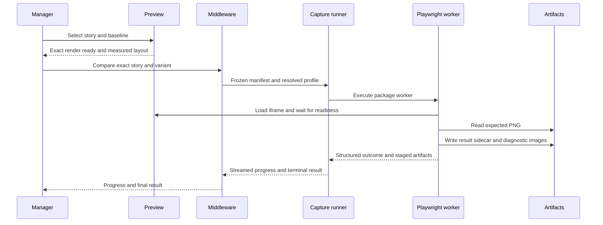

# Visual Delta architecture

This reference defines process boundaries, ownership, data flow, lifecycle, and failure isolation for Visual Delta. It separates presentation, rendering, orchestration, capture, artifacts, and repository operations.

## Component boundaries

Each component owns a bounded part of the system:

| Component               | Owns                                                                                                 | Must not own                                                              |
| ----------------------- | ---------------------------------------------------------------------------------------------------- | ------------------------------------------------------------------------- |
| Storybook manager       | Panel, Testing Module, toolbar status, action intent, progress presentation                          | Direct filesystem writes, screenshot capture, repository commands         |
| Storybook preview       | Story decorators, render readiness, capture metadata, overlay and split layout, interaction parking  | Baseline mutation, static-build decisions, repository state               |
| Dev middleware          | Request validation, exact scope, process coordination, change tracking, static-build policy, run hub | Product rendering, pixel algorithms, unapproved baseline writes           |
| CLI and host writers    | Approved baseline capture, wiring changes, skip and include source edits, scaffolding                | Presentation state, implicit scope expansion                              |
| Capture runner          | Transport a frozen capture manifest into the canonical Linux/ARM64 profile and return checksummed derived evidence | Scope expansion, comparison policy, direct unapproved repository writes   |
| Playwright suite        | Deterministic configured-browser capture, pixel comparison, staged artifacts, sidecar evidence        | Review approval policy, repository commits                                |
| Artifact store          | Baseline PNGs, local sidecars, affected cache, static Storybook                                      | Business logic or inferred review state                                   |
| Version-control adapter | Read-only history and guarded local commits                                                          | Push, amend, squash, branch creation, discard, remote mutation            |
| Host repository         | Port policy, snapshot layout, custom writers, script gates, package registration                     | Redefining portable package behavior without a host-profile specification |

## Normative requirements

These requirements preserve ownership and trustworthy state across process boundaries.

| ID          | Requirement                                                                                                                                                                                                                  |
| ----------- | ---------------------------------------------------------------------------------------------------------------------------------------------------------------------------------------------------------------------------- |
| VD-ARCH-001 | The manager, preview, middleware, CLI, capture-runner, Playwright, artifact, and version-control boundaries MUST remain explicit. A component MUST delegate work outside its boundary through a documented interface. The built-in runner MUST stage and invoke the package worker that created the frozen job; it MUST NOT depend on the consumer workspace exposing a `visual-delta` script, `.bin` entry, or resolvable local-link target inside the capture container. Executing an exported source entry from a packed dependency MUST use that package's shipped worker and MUST NOT be mistaken for a buildable source checkout. A buildable source checkout MUST locate its installed TypeScript compiler through the package manifest rather than requiring an unexported package subpath. |
| VD-ARCH-002 | Authoritative visual data MUST originate from a settled preview captured through a configured browser in the canonical Linux/ARM64 capture profile. A later comparison MAY reuse that raw actual PNG without relaunching a browser only when its exact target, render-input fingerprint, capture configuration, capture profile, dimensions, and checksum remain current; the result MUST identify cached-actual reuse and preserve the original capture provenance. Presentation state MUST NOT substitute for capture evidence. |
| VD-ARCH-003 | A story lifecycle MUST distinguish unknown, rendering, ready, running, complete, cancelled, and failed states where applicable. Actions that need a ready render MUST stay disabled while readiness is unknown or rendering. |
| VD-ARCH-004 | Baseline PNGs and story configuration are durable inputs. Derived actual, diff, result, static-output, run, and affected-cache evidence MUST live outside `snapshotDir`, be safe to regenerate, and never be mistaken for a committed baseline. |
| VD-ARCH-005 | Failure in one boundary MUST produce a typed or structured failure at its caller. It MUST NOT silently mutate another boundary, broaden scope, or report success.                                                            |

## End-to-end data flow

The normal comparison flow has one authoritative path:

The built-in runner transports an immutable staged copy of the initiating
package worker into the capture container. Workspace installation remains
responsible for the consumer's Storybook and project dependencies, but worker
selection does not resolve through the staged workspace's scripts,
`node_modules/.bin`, or local-link topology. Source-checkout development builds
the worker before staging it only when the executing module and package-local
build configuration both identify a buildable checkout. It resolves the
installed compiler from TypeScript's exported package manifest, so package
export restrictions on the `bin/tsc` subpath do not masquerade as a missing
compiler. Published consumers use the package's shipped worker even when
Storybook executes an exported file under the tarball's included `src/` tree.
Root-contained absolute snapshot and affected-cache arguments are
remapped to their equivalent `/workspace` paths before the Docker worker is
invoked; paths outside the frozen workspace are rejected.

Baseline mutation adds a write gate before Playwright starts and an invalidation step after the requested files are written. Repository automation occurs after the mutation succeeds and cannot affect capture semantics.

Compare-only artifact return is a narrow exception to the otherwise read-only
host workspace boundary. The runner may stage only result sidecars, their
`.actual.png` / `.diff.png` diagnostics, and the two package-owned affected
planning JSON files. The host copies them back only after traversal checks,
regular-file checks, checksums, capture-profile validation for sidecars, and
exact cache-path allow-listing. Baseline PNGs, sources, configuration, static
output, and unrelated caches are never valid compare-only return artifacts.
Known and project-configured workspace build-cache roots are excluded from both
staging and the post-run candidate inventory; an explicit runner result that
names one remains forbidden.

## Lifecycle ownership

The preview owns one render generation per selected story. It marks the generation ready only after Storybook emits the exact completion event and layout measurements settle. A Storybook navigation, force remount, hot-module replacement, or server restart invalidates the previous generation.

Middleware owns one run job and one frozen scope. The manager MAY unmount and reconnect to that job through the run hub. Cancellation changes the job state but does not convert incomplete stories into passing or failed comparisons.

## Failure isolation

Every boundary MUST preserve the last trustworthy state:

- A missing baseline reports missing coverage and does not infer a visual mismatch
- A failed capture reports an error and does not reuse an older actual image as current
- A stale sidecar remains visible only as stale evidence and does not establish a current result
- A partial static build is rejected and does not count as a runnable build
- A source-write conflict blocks the mutation or commit and preserves pre-existing edits
- A lost manager connection does not terminate a middleware-owned run

Related contracts: [Interfaces](./interfaces.md), [Capture and comparison](./capture-and-comparison.md), [Test runs and scopes](./test-runs-and-scopes.md), and [VCS and history](./vcs-and-history.md).
