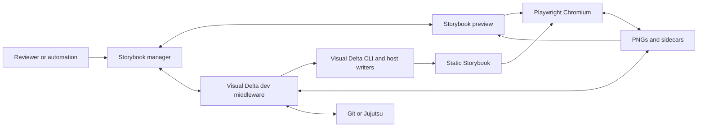

# Visual Delta system specification

This mdBook source is the source of truth for Visual Delta behavior in this repository. It defines the system boundaries, contracts, invariants, and acceptance criteria that every implementation must satisfy.

## Authority

Markdown files under `spec/src/`, except `SUMMARY.md`, are normative. Requirement words use the following meanings:

- **MUST**: required for conformance
- **MUST NOT**: prohibited for conformance
- **SHOULD**: expected unless a documented exception explains the tradeoff
- **MAY**: optional behavior that cannot weaken a MUST requirement

When documents disagree, use this order:

1. This specification corpus
2. An accepted specification change in the same commit
3. Automated tests and fixtures as implementation evidence
4. Package and host source code as implementation evidence
5. Package `README.md`, root `README.md`, `VENDOR.md`, `PARITY.md`, and completed plan files as explanatory or historical material

Tests and source code do not silently redefine the contract. A mismatch between implementation and this specification is a conformance defect or a proposed specification change.

## System map

Visual Delta connects Storybook manager state, the rendered preview, local Node middleware, Playwright, committed baselines, and version-control metadata.

The manager presents state and requests actions. The preview renders stories, exposes capture metadata, and displays comparisons. Middleware validates requests, freezes scope, coordinates processes, and applies allowed mutations. Playwright owns authoritative capture and pixel comparison.

## Component specifications

Each page has one system responsibility:

| Component                     | Normative reference                                   | Defines                                                                                       |
| ----------------------------- | ----------------------------------------------------- | --------------------------------------------------------------------------------------------- |
| System boundaries             | [Architecture](./architecture.md)                     | Processes, ownership, data flow, lifecycle, failure isolation                                 |
| Effective settings            | [Configuration](./configuration.md)                   | Host options, project defaults, story overrides, local preferences, environment variables     |
| Public and internal contracts | [Interfaces](./interfaces.md)                         | Exports, command-line interface, HTTP routes, events, query parameters, DOM markers, streams  |
| Baseline identity             | [Baseline model](./baseline-model.md)                 | Eligibility, paths, variants, metadata, sidecars, static serving, freshness                   |
| Browser behavior              | [Capture and comparison](./capture-and-comparison.md) | Readiness, capture targets, geometry, ignored regions, comparison authority, outcomes         |
| Interactive surfaces          | [Panel and preview](./panel-and-preview.md)           | Gallery, overlay, modes, interactions, results, review controls, persistence, reload behavior |
| Execution                     | [Test runs and scopes](./test-runs-and-scopes.md)     | Story, component, global, affected, static build, progress, reconnect, cancellation           |
| State changes                 | [Mutations and review](./mutations-and-review.md)     | Baseline writes, deletion, tags, configuration, invalidation, write gates                     |
| Repository integration        | [VCS and history](./vcs-and-history.md)               | History, change sets, automation, commit safety, prohibited operations                        |
| Repository host               | [UI catalog host profile](./host-profile.md)          | Local preset, custom writers, snapshot layout, scripts, ports, package and host ownership     |
| Specification policy          | [Specification governance](./spec-governance.md)      | Authority, spec-before-code ordering, protected paths, enforcement, generated output          |
| Conformance                   | [Verification](./verification.md)                     | Requirement-to-test traceability, audit evidence, known gaps, validation commands             |

## Core invariants

These invariants apply across all component specifications:

- A compare-only action MUST NOT create, overwrite, delete, or approve a baseline
- A baseline mutation MUST require explicit write authorization
- An empty action scope MUST remain empty and MUST NOT broaden to another scope
- The primary baseline, each configured mode baseline, and each wired interaction baseline MUST be treated as independent comparison targets
- Review metadata, comparison outcome, baseline coverage, and skip eligibility MUST remain independent state dimensions
- Live HTML comparison MAY aid diagnosis, but only Chromium capture and Playwright comparison are authoritative
- Baseline path resolution MUST use one canonical contract across capture, injection, serving, sidecars, history, deletion, and hydration
- Automation MUST default to off, and repository commits MUST require both project opt-in and host permission
- Missing or unreliable affected-run evidence MUST select all eligible stories
- A render MUST remain provisional until the exact story generation finishes and its measured layout settles
- Visual Delta implementation MUST never be ahead of its canonical specification

## Primary flows

The component pages define four cross-system flows:

1. **Read and compare**: resolve story configuration, wait for readiness, resolve the selected baseline, capture the live target, compare pixels, write diagnostic sidecars, and publish the result
2. **Create or update**: freeze exact story IDs, verify write authorization, build a complete static Storybook when required, capture target variants, write only the requested baselines, update wiring, invalidate stale evidence, and mark written stories pending
3. **Run a scope**: freeze visible and affected IDs, execute enabled actions in contract order, stream progress, retain reconnectable status, and never broaden an empty scope
4. **Review and commit**: change independent review metadata, record exact file mutations as a change set, validate repository safety, and commit only when both workflow and host gates permit it

## Terminology

The specification uses these terms consistently:

- **Baseline**: a committed PNG that represents an expected story rendering
- **Primary baseline**: the end-of-play PNG for one story without a named mode or interaction
- **Mode baseline**: a PNG for one named set of Storybook globals
- **Interaction baseline**: a PNG captured at one wired play-function capture point
- **Sidecar**: local JSON, actual PNG, or diff PNG evidence beside a baseline
- **Authoritative comparison**: a Chromium or static Playwright comparison that can establish official result state
- **Live HTML comparison**: an in-browser DOM-to-image approximation used only for diagnosis
- **Review status**: one of pending, ready, approved, or failed
- **Coverage**: whether the expected baseline variants exist and are wired
- **Eligible story**: a story included by the visual suite and not tagged `skip-visual`
- **Action scope**: the frozen set of story IDs for one Testing Module or panel operation
- **Affected plan**: a conservative story selection derived from changed inputs, the Storybook graph, and passing cache evidence
- **Change set**: the exact before-and-after files produced by one Visual Delta mutation

## Changing the contract

Every intentional behavior change MUST follow [Specification governance](./spec-governance.md) and update the specification before or with implementation:

1. Edit the relevant requirement and preserve its stable ID when its intent remains the same
2. Add a new requirement ID when the behavior adds a distinct obligation
3. Update [Verification](./verification.md) with tests, fixtures, or a declared gap
4. Update implementation and focused regression coverage
5. Run the verification commands that cover the changed boundary
6. Update explanatory documentation only after the normative contract is coherent

Removing or weakening a requirement requires an explicit rationale in the change description. Historical plan completion does not authorize a contract change.
